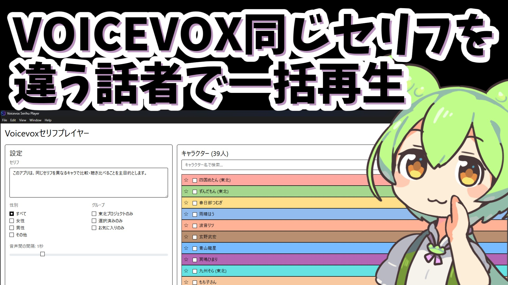

# Voicevoxセリフプレイヤー
### 〜 VOICEVOX対応 多キャラ一括音声生成ツール 〜

**Voicevoxセリフプレイヤー**は、人気のOSS音声合成エンジン[VOICEVOX](https://voicevox.hiroshiba.jp/)と連携し、複数のキャラクターに同じセリフをまとめて読み上げさせ、一つの音声ファイルとして出力できるデスクトップアプリケーションです。

ノベルゲームのボイス作成、コンテンツ制作でのキャラクターの声の比較・検討などを効率化します。

<br>

### 🎥 使い方動画
[](https://www.nicovideo.jp/watch/sm45311403)
<br>

## 📥 ダウンロード (Download)

**最新版のインストーラーは以下のリリースページからダウンロードできます。**

**[▶ 最新版をダウンロードする](https://github.com/iDate-kun/voicevox-serifu-player/releases/tag/v1.0.0)**

<br>

---

### ✨ アプリケーションの画面


---

## 📖 使い方

### 1. 準備
まず、PCに **[VOICEVOX](https://voicevox.hiroshiba.jp/)** をインストールし、エディタを起動しておいてください。

### 2. インストール
上記**ダウンロード**リンクから、最新版のインストーラー (`.exe` ファイルなど) をダウンロードし、画面の指示に従ってインストールします。

### 3. 音声生成
インストールした「Voicevoxセリフプレイヤー」を起動し、
1.  **セリフ**を入力します。
2.  音声を作りたい**キャラクターを選択**します。
3.  **「音声生成」**ボタンを押すと、`output` フォルダにMP3ファイルが作成されます。

---

## 🌟 主な機能

*   **多キャラクター・多スタイル対応:** 複数のキャラクターやスタイル（ノーマル、あまあま等）を自由に組み合わせて選択できます。
*   **一括音声生成:** 選択したすべてのキャラクターで同じセリフの音声を一度に生成します。
*   **柔軟なフィルター機能:** 性別、グループ（東北家など）、お気に入り、名前検索でキャラクターを簡単に絞り込めます。
*   **音声結合と出力:** 生成した音声を指定した間隔（秒数）で結合し、1つのMP3ファイルとして出力します。
*   **便利なオプション:** 音声の頭に話者名を自動で読み上げさせる機能や、生成後の自動再生機能があります。

---

<details>
<summary><strong>🛠️ 開発者向け情報 (For Developers)</strong></summary>

本アプリケーションを自身で改造したり、開発に貢献したい方向けの情報です。

### 前提条件
*   [Node.js](https://nodejs.org/) (v18.x 以上を推奨)
*   [VOICEVOX](https://voicevox.hiroshiba.jp/) (事前にエディタを起動しておいてください)

### セットアップ
```bash
# 1. リポジトリをクローン
git clone https://github.com/your-username/voicevox-serihu.git
cd voicevox-serihu

# 2. 依存関係をインストール
npm install

# 3. アプリケーションを起動
npm start
```

### 使用技術 (Tech Stack)
*   **フレームワーク:** [Electron](https://www.electronjs.org/)
*   **UIライブラリ:** [React](https://reactjs.org/)
*   **スタイリング:** [Bootstrap](https://getbootstrap.com/)
*   **音声処理:** [fluent-ffmpeg](https://github.com/fluent-ffmpeg/node-fluent-ffmpeg)
*   **パッケージ化:** [electron-builder](https://www.electron.build/)

</details>

---

## ⚠️ 注意事項

*   本アプリはVOICEVOX公式ではなく、有志による非公式のAPI連携ツールです。
*   VOICEVOXおよび各キャラクターの利用規約を必ず遵守してください。

## 📄 ライセンス

このプロジェクトは [MIT License](LICENSE) のもとで公開されています。

## 　　キーワード
VOICEVOX, 音声合成, TTS, 多キャラ読み上げ, ノベルゲーム, VTuber, フルボイス化, Electron, デスクトップアプリ

## 　　補足情報

本アプリはGemini CLIが9割。1割ChatGPTによって作成されました
VOICEVOX　Version 0.24.2で起動確認